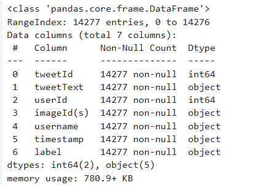
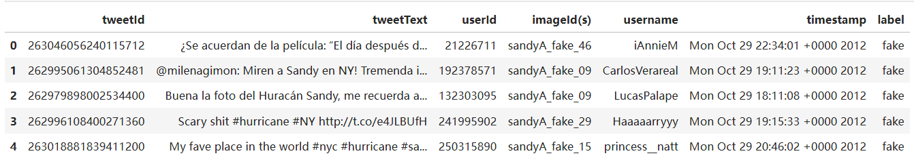
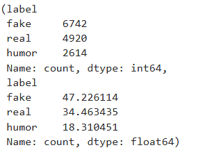
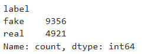
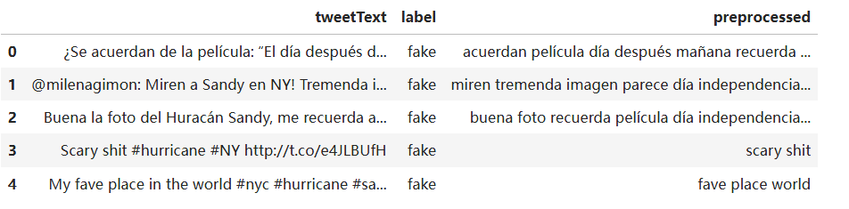
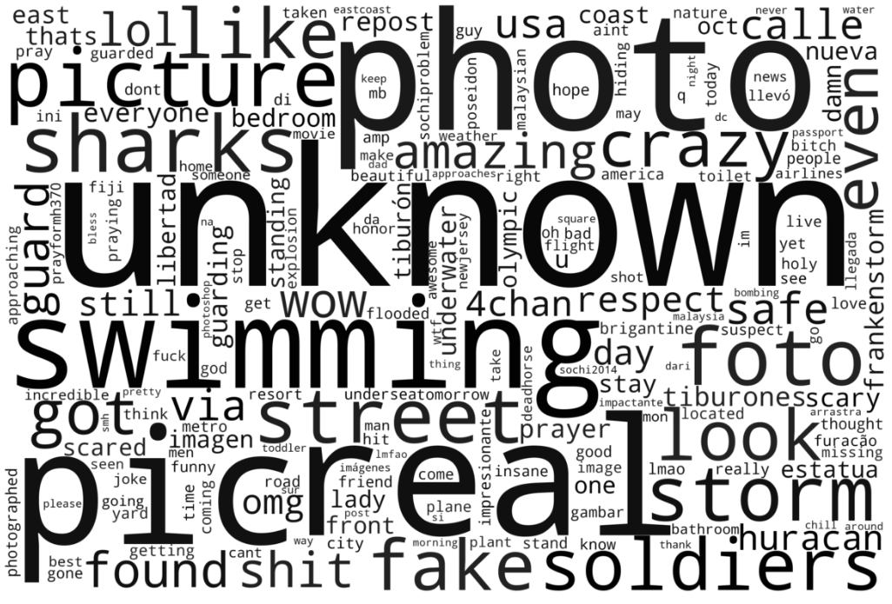
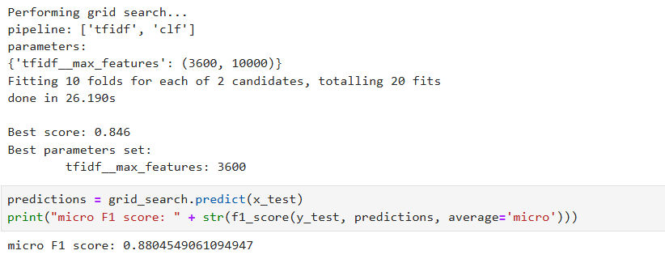
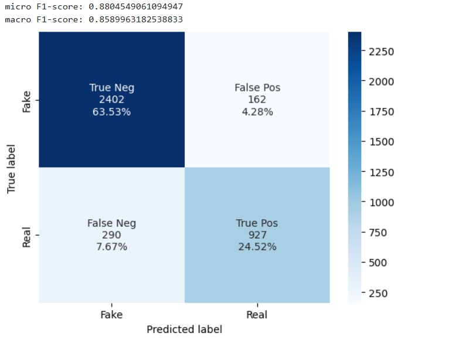
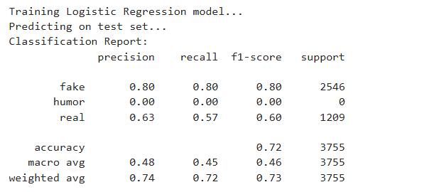
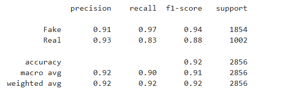

# 实验报告  
**杨清华 2021201376**  

## 项目核心内容  

### 目标  
构建一个模型，能自动判断给定的新闻内容是真实的还是虚假的。(虚假新闻检测)

### 方法  
- **自然语言处理**：提取文本的特征，比如词频、情感、句法、语义信息等。  
- **机器学习/深度学习**：利用分类器（如逻辑回归、随机森林、支持向量机）或深度学习模型（如 LSTM、BERT、Transformer）进行训练。  

### 数据  
- **公开数据集**：2015年 MediaEval 挑战赛的推特数据集。  

### 实验环境  
- RTX3060
---

## 技术实现  

### 数据预处理  
- **文本清理**：去除标点、停用词、HTML标签等。  
- **词向量生成**：如 TF-IDF、Word2Vec、GloVe、BERT 等。  

### 模型选择  
- **基于规则的传统模型**：如 TF-IDF + SVM  
- **基于上下文的嵌入 + 传统模型**：BERT + logistic  
- **预训练语言模型**：BERT。  

### 性能评估  
- **分类指标**：准确率（Accuracy）、召回率（Recall）、F1 分数（F1-score）等。  
- **混淆矩阵**：分析模型的分类表现。  

---

## 分析数据集  
这个数据集以推文文本为主要特征，可以通过文本分析和分类技术对数据进行建模，以下是数据的结构和部分内容的初步概览：  

  
  

可见数据共有7列：  
- `tweetId`: 唯一推文标识符。  
- `tweetText`: 推文内容。  
- `userId`: 用户ID。  
- `imageId(s)`: 图片ID（如果有）。  
- `username`: 用户名。  
- `timestamp`: 推文时间戳。  
- `label`: 是否为虚假新闻的标注。  

接下来我们将对数据集进行初步清洗和探索性分析，包括以下步骤：  
- 检查缺失值和重复值。  
- 标签分布情况分析。  
- 推文长度的基本统计。  

  

由于我们只判断新闻真假，所以这里将数据集中的 `humor` 类也归为 `fake` 类别。  

  

---

### 进一步数据清理  
准备预处理推文文本，包括去除停用词、标点，删除了 URL 链接、提及 (@user) 和标签 (#tag) 等。  

  

查看不同标签中最常用的词汇。  

  
  

---

## 特征提取以及初步建模  

### TF-IDF 特征提取  
提取了推文的文本特征，创建一个稀疏矩阵。该矩阵可直接用于分类模型的训练。然后对训练集以及测试集使用简单分类器（SVM）进行初步建模。  

  
  

图中不难发现：  
TF-IDF + SVM 的组合对于虚假新闻检测的效果不是很好，这可能是由于 TF-IDF 的局限性：  

- **上下文缺失**：TF-IDF 只关注词的频率和分布，无法捕捉词语之间的上下文信息。对于推文这样短文本数据，句子的语义很重要，而 TF-IDF 缺乏语义理解能力。  
- **无法处理同义词和多义词**：不同单词可能表达相同语义，但 TF-IDF 无法捕捉这种关系。同样地，单词的多义性也会导致误判。
- **适用性**：TF-IDF 更适合文本较长、上下文依赖较小的任务（如文档分类）。短文本（如推文）中，现代嵌入方法（如 BERT 或其他预训练语言模型）通常更适合。  

---

## 改进思路：使用上下文嵌入方法  

对于虚假新闻检测，我们可以使用预训练语言模型（如 BERT、mBERT、XLM-R 等）来提取文本特征：  

- **BERT**：捕捉上下文信息，适合英语文本。（BERT 使用 双向 Transformer 结构，同时从文本的前后文中学习特征）  
    - **传统方法的局限**：TF-IDF 和 Word2Vec 等方法无法有效捕捉单词在上下文中的不同含义。例如，bank 在 "river bank" 和 "money bank" 中表示不同的概念。  
    - **BERT 的优势**：可以为每个单词生成动态上下文相关的嵌入。  
这类模型能够更好地捕捉推文的语义和细微差别，尤其适合这种虚假新闻检测任务。
---

## 下一步计划  
- 使用 Hugging Face 的 `bert-base-uncased` 模型进行嵌入提取：  
    - 输入处理：将文本分词并限制长度为 128。  
    - 提取嵌入：使用模型最后一层隐藏状态，进行平均池化（mean pooling）以生成句子嵌入。  
    - 保存结果：嵌入保存为 `.npy` 文件，以便后续加载用于分类任务。  
- 使用分类模型（Logistic Regression）完成分类任务。  

  

从分类报告来看，模型在 `fake` 类别上的表现还算可以，但在其他类别（尤其是 `humor` 和 `real`）上的表现不够理想。  

**原因分析**：  
- **类别不平衡**：如果训练集中某些类别的数据量过少（如 humor 类别），模型会倾向于忽略这些类别。检查训练集的类别分布是否均衡。
- **模型偏向性**：模型可能过于偏向 fake 类别，导致对其他类别（如 real 和 humor）的召回率过低。  
- **特征提取不充分**：使用了 BERT 提取特征，但没有进行微调，可能导致特征对具体任务的适应性不够强。  
- **模型选择局限性**：逻辑回归虽然简单高效，但可能无法充分捕捉 BERT 嵌入的复杂非线性关系。 

在这里，我采用了使用加权损失函数的方式为每个类别分配权重，使得样本较少的类别在训练中被赋予更大的重要性，但是最终结果并没有得到显著改善。
---

## 改进思路：不再使用BERT 嵌入 + 逻辑回归，改用BERT 模型微调 

### BERT 嵌入 + 逻辑回归的局限性  
1. 提取的 BERT 嵌入是静态的，一旦生成，就不再根据任务目标（如虚假新闻分类）进行调整。嵌入仅表达了通用语义特征，而不是针对具体任务优化的特征。
2. 逻辑回归是线性模型，只能捕捉输入特征与输出类别之间的简单线性关系。BERT 嵌入是高维非线性表示，逻辑回归无法充分利用其复杂结构。
3. 提取 BERT 嵌入时，通常选择最后一层或其池化表示（如 [CLS] token）。这种固定表示可能导致部分语义信息的损失，尤其是对细粒度的任务特征（如情感、修辞等）的捕捉能力不足。
4. BERT 嵌入的生成与逻辑回归的训练是两个独立的阶段，特征和目标之间缺乏直接的对齐。逻辑回归只能基于现有的嵌入进行分类，无法进一步优化特征。
5. 逻辑回归的学习能力依赖于输入特征的质量，而静态嵌入无法完全挖掘训练数据的潜力。
 

### BERT 微调的优势  
1. BERT 模型在训练过程中，其参数会根据任务目标（分类）进行动态调整，嵌入表示更能捕捉任务相关的特征。微调后的嵌入结合了 BERT 的强大语义理解能力和任务特定信息。
2. BERT 的 Transformer 结构是高度非线性的，可以更好地捕捉高维嵌入的深层特征。微调过程中，BERT的所有层都参与训练，可以动态调整每一层的表示以适应任务需求，减少信息损失。
3. 微调过程中，特征生成与分类目标是联合优化的，模型能更好地学到与目标相关的特征表示。
4. 微调过程中，BERT 会结合训练数据动态调整特征，能更高效地利用数据中蕴含的信息。

  

---

## 最终结果  

考虑到上述分析，最终采用基于 **BERT 模型微调** 的虚假新闻检测项目，训练结果如下：  

  

可见最终测试集上的预测结果非常好，无论是 `Fake` 类别还是 `Real` 类别都有不错的预测准确率、召回率以及 F1-score。

---
## 实验总结  

本项目基于 BERT 模型微调及传统机器学习方法，成功构建了一套虚假新闻自动检测系统，旨在通过自然语言处理与深度学习技术提高新闻文本真实性判定的准确性和适应性。系统针对新闻文本的特征与上下文信息，结合现代嵌入方法与分类器，实现了高效且精确的虚假新闻分类任务。  
 
**主要优势与亮点**

数据覆盖全面：项目使用 2015年 MediaEval 挑战赛的推特数据集，涵盖多类别标注（如 fake、real 和 humor），数据量丰富且贴合真实社交媒体环境，有效提升了模型的泛化能力。

技术路线清晰：项目在实验过程中逐步对比并优化了不同技术方案，包括：

传统方法：TF-IDF + SVM 初步建模，揭示了特征稀疏性与上下文缺失的局限。
现代嵌入：BERT 嵌入 + 逻辑回归，验证了预训练语言模型在文本特征表达上的优势。
BERT 微调：对 BERT 模型进行任务特定微调，显著提高了分类效果，充分利用了上下文语义信息。
高准确率与稳定性：最终基于 BERT 微调 的模型在测试集上取得了优秀的分类性能，fake 和 real 类别均表现出高预测准确率、召回率与 F1-score，满足任务要求。

**问题定位与改进思路**：

类别不平衡问题：通过加权损失函数缓解了小样本类别（如 humor）带来的模型偏向性。
模型适配：深入分析 BERT 微调与静态嵌入 + 逻辑回归的优缺点，进一步明确了任务优化路径。
实用性与拓展性：
针对多语言新闻检测任务，提出了两种改进思路：

使用更适合多语言任务的预训练模型（如 mBERT）。
将多语言文本统一翻译为英语，再利用 BERT 进行检测，提升系统的实际应用价值。

---

## 进一步改进思路  

- **多语言文本检测**：  
    - 由于这个测试集其实是多语言文本，而Bert-base模型只能处理英文文本，所以此处本应使用mBERT模型来实现多语言虚假新闻检测，但是实测效果十分差劲，可以说是完全没有使用价值，未来将使用其他模型进行进一步改进或者使用工具将多语言统一翻译为英语然后继续使用bert模型来进行检测。（两个大致思路） 

---

### 代码链接

[GitHub 仓库地址](https://github.com/xizunkong/nlp24projects)